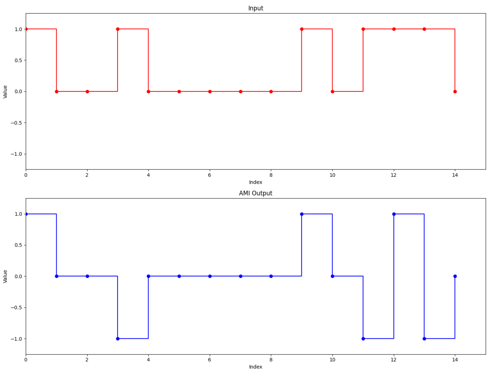
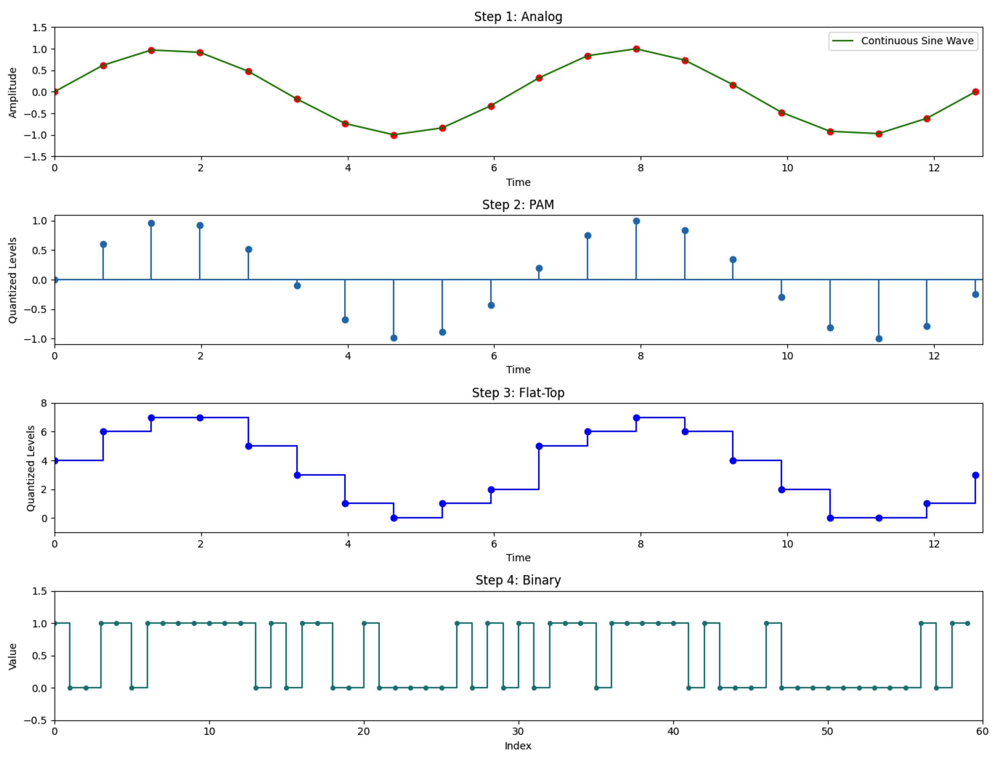

# Documentation

## Team:
- Rajes Manna (2021BITE063)

## Language and Libraries used:
- Python
- Matplotlib
- Tkinter
- Random and Timedata

## Introduction
In this project, a user-friendly interface (GUI) was developed for converting and encoding signals, including Pulse Code Modulation (PCM). The tool, created in Python, supports various signal encoding techniques like NRZ-L, NRZ-I, Manchester, Differential Manchester, AMI, and PCM. The GUI, designed with Tkinter, enables users to visually observe signal representations using Matplotlib. An engaging feature of this project is the incorporation of animated visuals, enhancing the interactivity of the tool for users.

## Implementation
The implementation of the digital signal converter involved utilizing Python for the core logic and Matplotlib, Tkinter for creating an intuitive user interface. The converter supports multiple line coding schemes, allowing users to choose from NRZ-L, NRZ-I, Manchester, Differential Manchester, and AMI. Additionally, a digital PCM converter was implemented to convert analog signals into a digital format.

## Getting Started
### Code
```bash
python3 -m venv venv
source venv/bin/activate
git clone https://github.com/rmrajesofficial/Line-Encoder-and-Decoder-Project.git
pip3 install -r requirements.txt
python3 DtD.py
python3 AtD.py 
```

## Input

### Digital
For digital input, users can provide a binary sequence of 0s and 1s. Additionally, the GUI includes a selection section allowing users to choose the desired line coding scheme (NRZ-L, NRZ-I, Manchester, etc.). To facilitate testing and experimentation, a button for generating a random input stream is also available.

### Analog
For analog input, users can specify a sinusoidal or cosinusoidal waveform, along with parameters such as frequency, sampling rate, and bit rate.

## Output

### Digital
The digital output is the result of the conversion process based on the selected line coding scheme. The GUI displays the transformed digital signal, and users can observe the dynamic changes in the signal waveform.

### Analog
The analog output consists of the sampling bits and the resulting bits after the conversion process. The GUI displays three diagrams: one illustrating the sampled signal, another showing the signal after flattop sampling, and a third displaying the resulting bits.

## Test Cases

### Input
Binary sequence: 1, 0, 0, 1, 0, 0, 0, 0, 0, 1, 0, 1, 1, 1, 0
Line coding scheme: AMI

### Output
Transformed digital signal: 1, 0, 0, -1, 0, 0, 0, 0, 0, 1, 0, -1, 1, -1, 0

### Visuals


### Input
Signal type: Sine wave
Frequency: 2
Sampling rate: 30
Bit depth: 3

### Output
Resulting bits: 100110111111101011001000001010101110111110100010000000001011

### Visuals


## Resources Used:
- YouTube (Learning Libraries)
- ChatGPT (Syntax and Error Assistance)
- LaTeX (Project Report Writing)

**[Github repo](https://github.com/rmrajesofficial/Line-Encoder-and-Decoder-Project)**